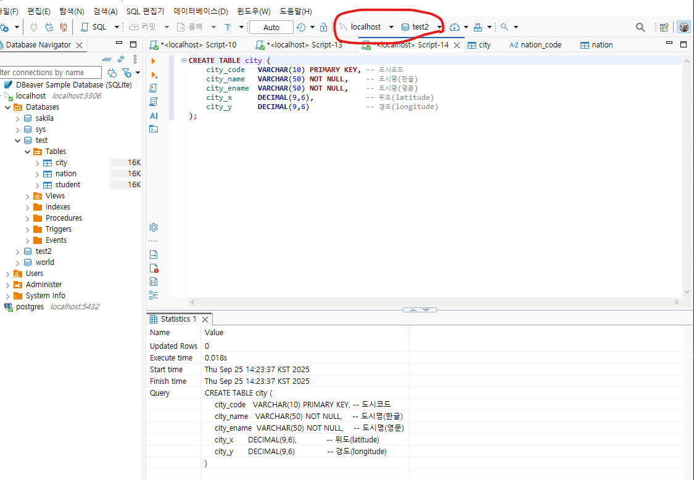
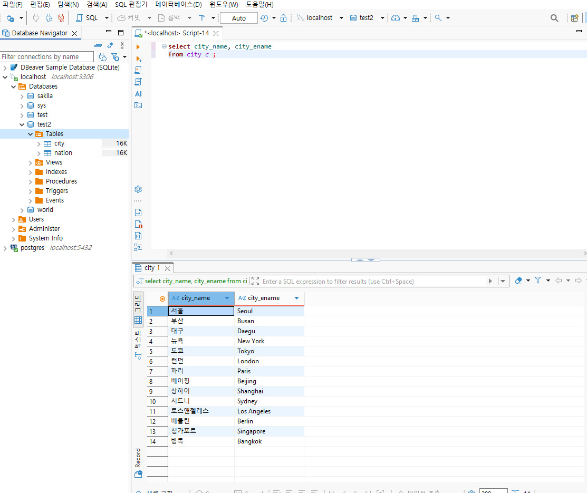
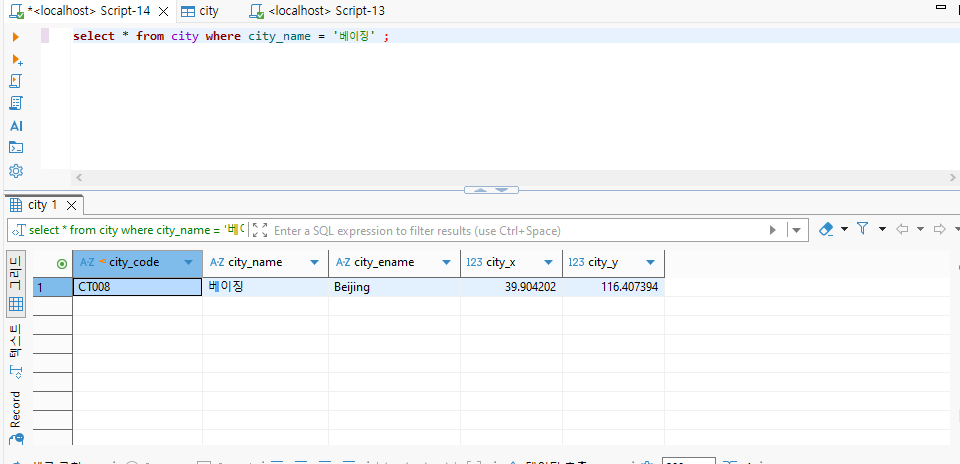

# MySQL과 PostgreSQL DB를 이용한 DBeaver
 
## 1. 엑셀 정리  
  

- 위 이미지처럼 데이터를 엑셀로 구현

## 2. 어느정도 구현 된 파일을 gpt를 이용해 데이터를 채우고 DDL, DML 생성  

- DDL = DB 구조 정의 (CREATE, ALTER, DROP, TRUNCATE)

- DML = DB 데이터 조작 (SELECT, INSERT, UPDATE, DELETE)

## 3. DBeaver를 이용해
- 새로운 데이터베이스 만들기 -> mysql 선택 -> root password 입력 후 완료

- datavases에 create datavase로 생성  


- sql 편집기로 new script 생성 후 gpt한테 받은 ddl, dml 붙여넣고 ctrl+enter  

**만들고자 하는 database가 맞는지 항상 확인**
**select는 찾고자 하는 정보, from은 해당 database**
- 스크립트에
```
select * from city c ;
```
입력시  
  

```
select city_name, city_ename from city c ;
```
입력시
  
- 열_리스트는 값이 저장된 열 이름을 콤마(,)로 구분해 나열

### 등 데이터 검색 select문의 여러 문법

#### 중복 행을 제거하고 검색 : DISTINCT

#### 조건 검색 : WHERE절
  
- = (등호) ⇒ 완전 일치만  

  
- % 사용하려면 반드시 LIKE와 함께 써야 함. = 와 함께 쓰면 의미 없음.
- LIKE '값'에 와일드카드가 없으면 사실상 =와 동일(느릴 수 있음).

#### 순서화 검색 : ORDER BY절
   
- asc는 오름차순, desc는 내림차순
#### 집계 함수 검색 : count(), max(), min(), sum(), avg()
 

#### 그룹화 검색 : group by절  

#### 그룹 조건 검색 : having절  

#### like 문자 연산자 검색 : '_', '%' 와일드카드  
 

#### 널 값 검색 : is null, is not null
  

#### 집합 연산자를 이용한 검색 : union

#### 서브 질의문을 이용한 검색 

#### 조인 검색 : join(크로스조인, 동등조인, 셀프조인, 외부조인)
같은 행이 없다면 칼럼 추가로 같은 행을 넣어주고 script에
```
UPDATE table name
SET 칼럼이름 = '넣고싶은 값';
```
하면 값이 추가됨.  
  

- 크로스조인
