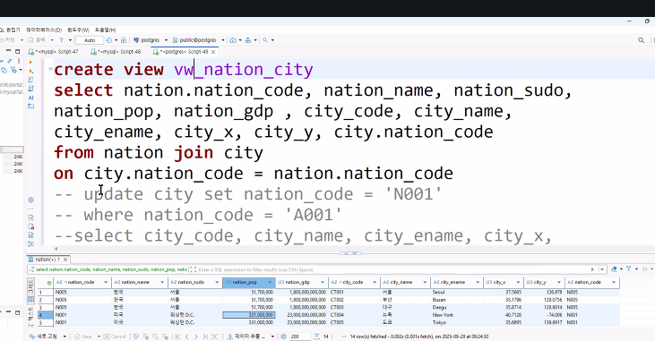
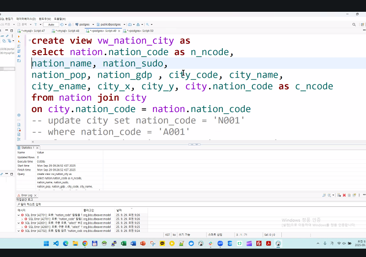

add로 바꾼 후 modify

```
INSERT INTO nation (nation_code, nation_name, nation_sudo, nation_pop, nation_gdp, global_code)
SELECT
  CONCAT('Q', LPAD(@row := @row + 1, 7, '0')) AS nation_code,   -- N0000001 ~ N1000000
  CONCAT('국가', @row) AS nation_name,
  CONCAT('수도', @row) AS nation_sudo,
  @row * 1000 AS nation_pop,
  @row * 5000 AS nation_gdp,
  CASE
    WHEN @row % 3 = 1 THEN 'ASIA'
    WHEN @row % 3 = 2 THEN 'AMERICA'
    ELSE 'EUROPE'
  END AS global_code
FROM (
  SELECT 1 FROM information_schema.tables t1, information_schema.tables t2 LIMIT 1000000
) tmp, (SELECT @row := 0) r;
```