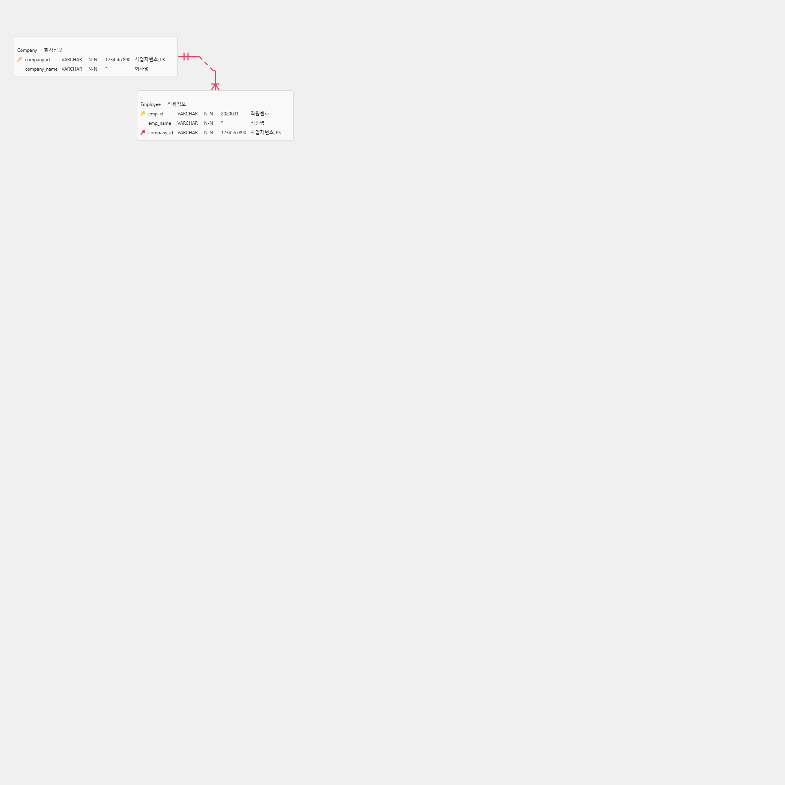
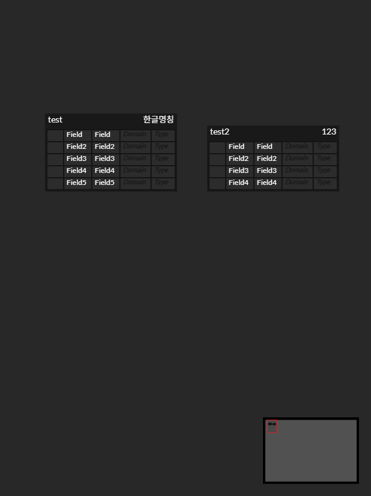
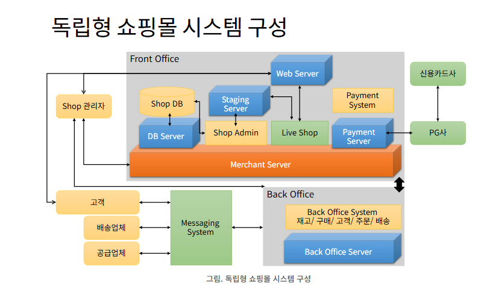

# DB 설명
## 포탈 시스템

### 1. 포탈은 전세계의 국가, 도시의 정보를 갖고 있음. (table 생성)

### 2. 도시는 항구도시와 육지 도심 지역으로 항구와 인접하지 않을 수 있습니다.

### 3. 컨테이너선이 컨테이너 수출입 업무를 담당합니다. 선적, 하적의 정보가 있습니다.
--------------------------------------------------------------------------------------------
### 4. 쇼핑몰은 전세계 제품을 수입, 수출, 판매 대상의 물건은 마치 아마존과 유사합니다.
### 5. 입점몰 개념으로 쇼핑몰을 운영하는 슈퍼관리자, 몰 관리자가 있습니다.
### 6. 상품에 대한 정보가 있습니다. 상품은 11번가와 같이 다양하게 카테고리가 있습니다.
### 7. 각 데이터는 로그 이력을 갖게 됩니다. 로그인, 상품이 판매될 때, 배가 이동할 때 등 모든 데이터의 처리 이력이 있습니다.
### 8. 판매 대상의 제품은 WMS 기반의 창고에 물류로 입출고 됩니다. (수불관리)
### 9. 판매 물품의 재고 관리를 의미합니다. 
### 10. 단체 비품 구입처가 있습니다. 초중고대학교에서 비품을 구매합니다.
### 11. 개인도 구매합니다. 상품의 종류, 단가, 패키지, 장바구니 .. 등 쇼핑몰의 데이터 구조를 다 가지고 있습니다.
### 12. 단체 구입처 에서는 상품에 대한 사용 이력이 학교, 학년, 반 별로 구분되어 데이터 시각화 화면으로 제공됩니다.

### 2025.09.24 / ver 0.1
### 작성자 : 홍길동

학교 식단 및 운영에 대한 DB
## ERD

## Skill set

## 기술 스택
### DBMS : mariaDB, MySQL, MSSQL, Oracle에 모두 테이블링, 데이터를 넣고, 그 데이터를 쿼리할 수 있는 기반

## 평가방법
### 당일 본인이 만든 DBMS에 각각 4번 접속해서, 서로 질의를 하여, 쿼리를 합니다.
### CRUD 쿼리가 되고, A 발표자가 화면 공유를 통해 ERD, 물리적인 테이블 쿼리로 select 데이터를 보이고 B 등의 참관자가 해당 데이터의 CRUD(insert, join 데이터 200건 보여주세요 등)
### A 만든 수준, 참관자의 질문 수준이 최종 평가 대상
**본인이 만든 것에 대해 설명 제대로 할 수 있어야함**

엑셀로 설명이 불가하면 db 설계가 불가

고객(customer): 개인/단체 구분 가능해야 함

주문/결제(order, payment): 판매 로그를 남기려면 필요

로그(log 테이블): 로그인, 판매, 이동 등 이벤트성 로그 (지금 shipping_log는 선박에 특화된 로그임, 통합 system_log 같은 게 필요)

단체 사용 이력(usage_log): 학교/학년/반 별 상품 사용량 기록